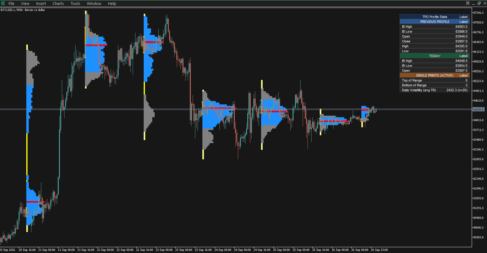
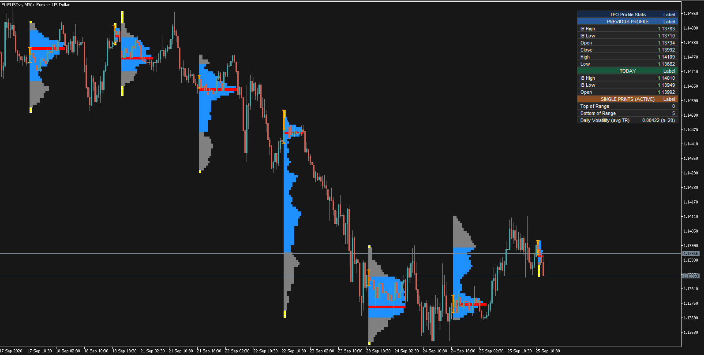

# Market Profile Indicator

A Market Profile indicator developed for **MetaTrader 5 (MQL5)**, with a corresponding **TradingView (Pine Script)** version.

This project demonstrates the implementation of trading tools across different platforms and programming environments, with a focus on Market Profile concepts, session analysis, and market structure.

## Overview

The indicator was developed to provide a visual representation of Market Profile information and key auction-market levels.

The project includes:

- Point of Control (POC)
- Value Area High (VAH)
- Value Area Low (VAL)
- Session-based Market Profile
- Customizable parameters
- Visual representation of market structure and profile levels

## MetaTrader 5

The **MQL5 version** is included in this repository.

### Files

- `MQL5/MarketProfileTPO.mq5` — MQL5 source code
- `MQL5/MarketProfileTPO.ex5` — compiled MetaTrader 5 indicator

### Screenshots

## TradingView — Pine Script

A **Pine Script version** of this indicator was also developed for TradingView.

The Pine Script source code is not included in this repository.

For the **TradingView / Pine Script version**, please contact me directly.

## Technologies

- **MQL5**
- **Pine Script**
- **MetaTrader 5**
- **TradingView**

## Purpose

This project demonstrates experience in:

- Developing custom trading indicators
- Translating trading concepts into programmatic logic
- Working with both **MQL5 and Pine Script**
- Building tools for different trading platforms
- Designing trading-oriented visualizations and calculations

## Contact

Interested in the TradingView / Pine Script version or custom Pine Script / MQL5 development?

Feel free to contact me:

- **Telegram:** [@keiwan_k99](https://t.me/keiwan_k99)
- **LinkedIn:** [Keiwan K99](https://www.linkedin.com/in/keiwan-k99/)
